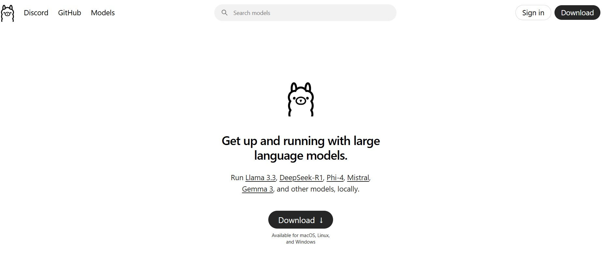
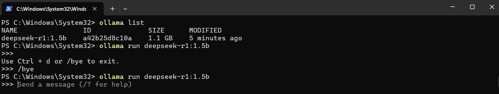
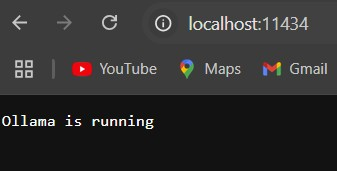
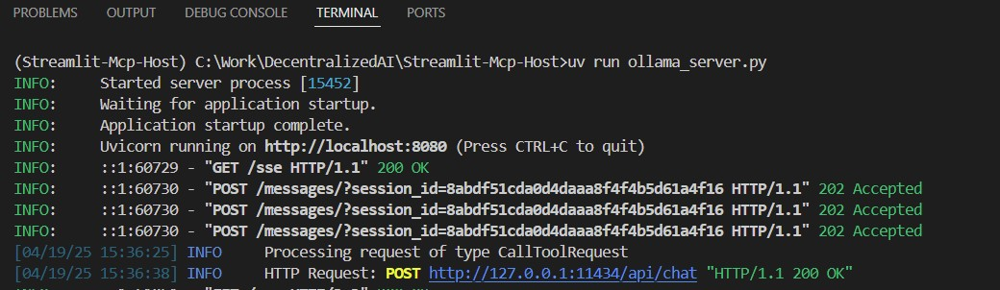
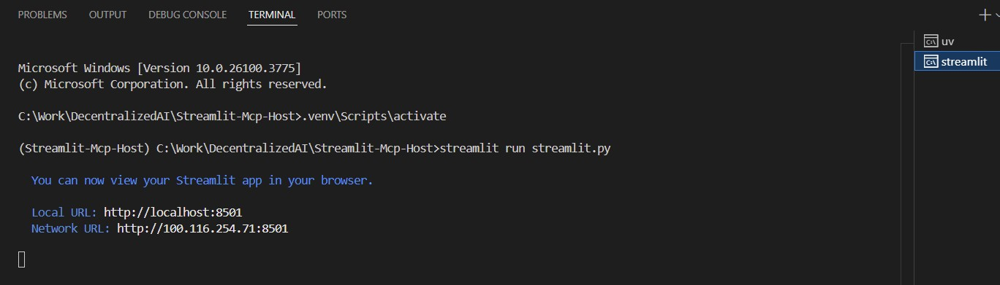
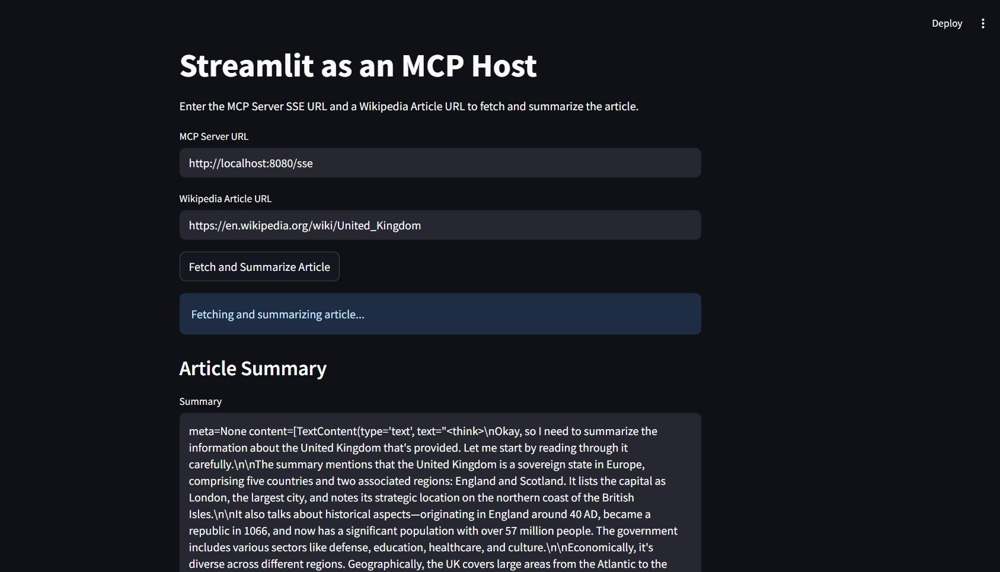
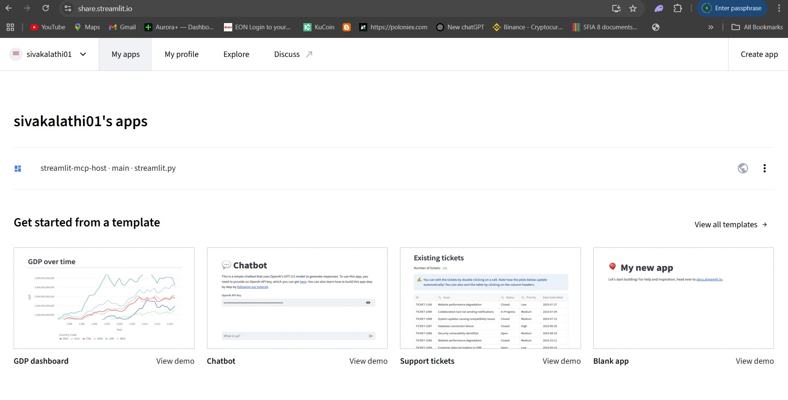
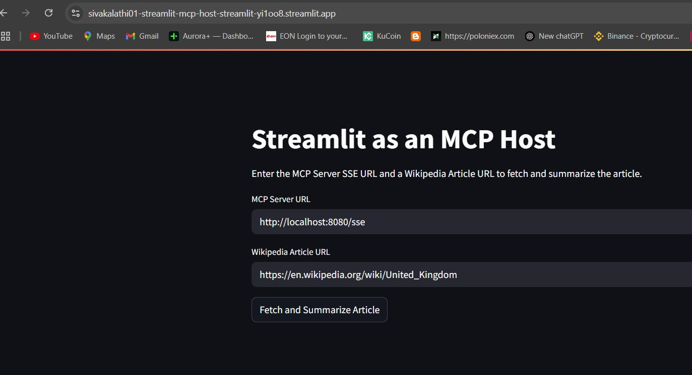

# Streamlit MCP Host

## What is MCP?

[MCP](https://modelcontextprotocol.io/) is an open protocol that enables AI models to securely interact with local and remote resources through standardized server implementations. This list focuses on production-ready and experimental MCP servers that extend AI capabilities through file access, database connections, API integrations, and other contextual services.

## Ollama Website

[Ollama](https://ollama.com)

## Ollama Server Start

## Ollama server is running

## MCP Server is running

## Streamlit Host is running

## Streamlit Host Web Page

## Streamlit App Deployment

## Streamlit App is running on community cloud

